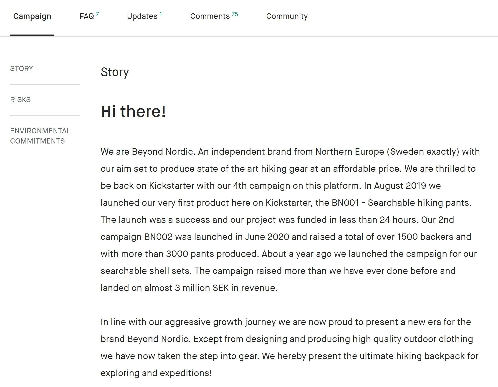
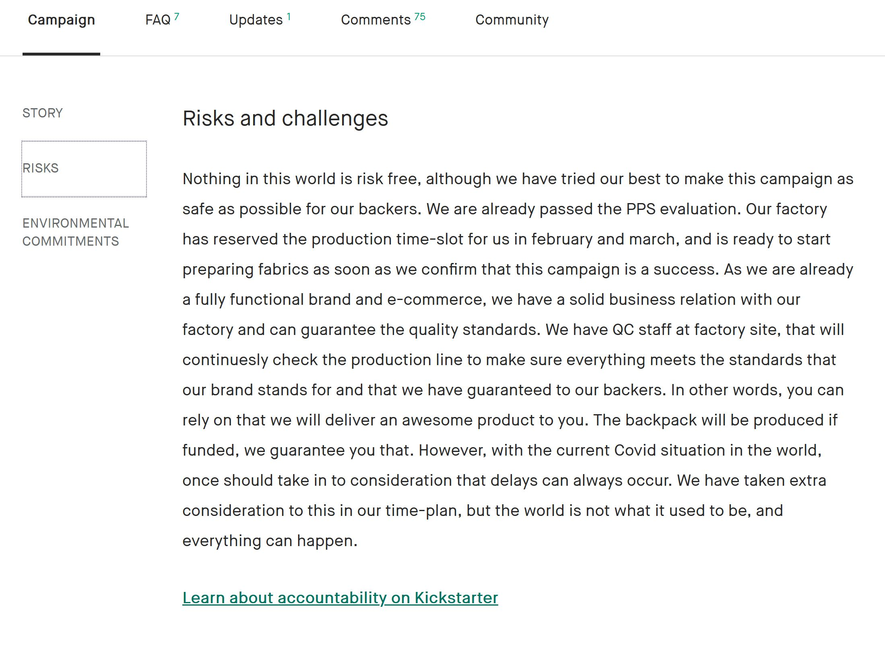
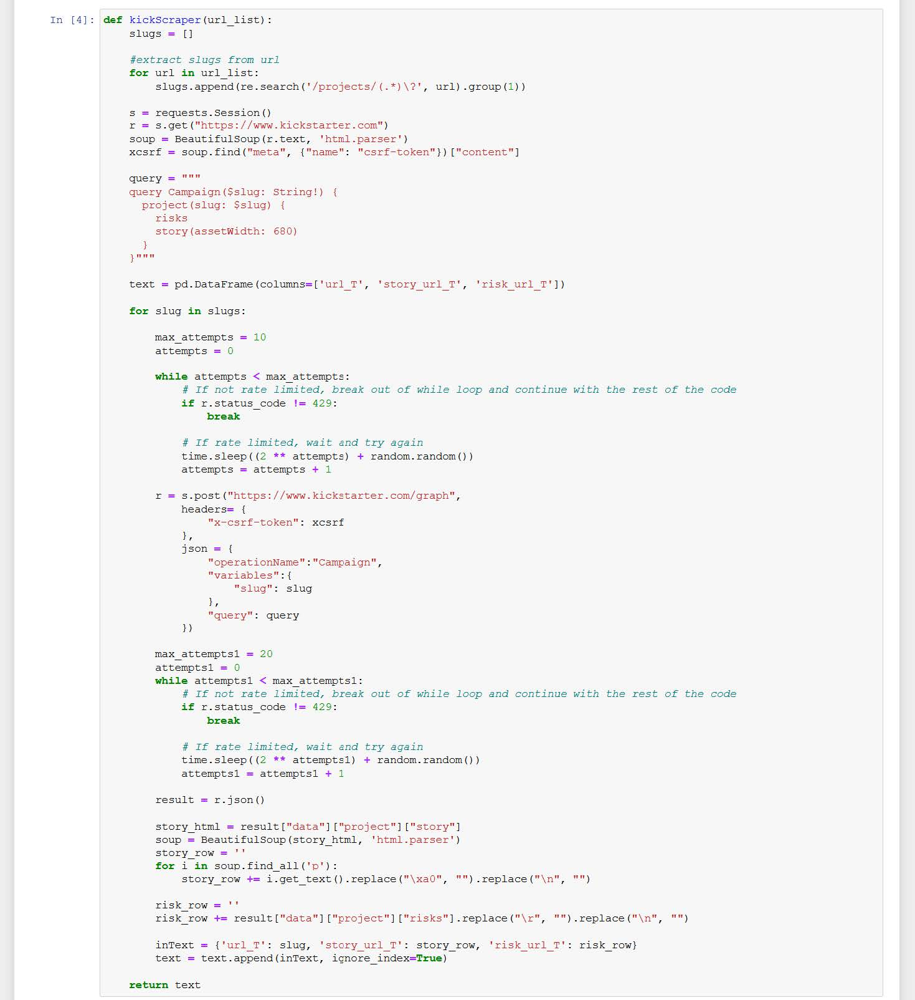
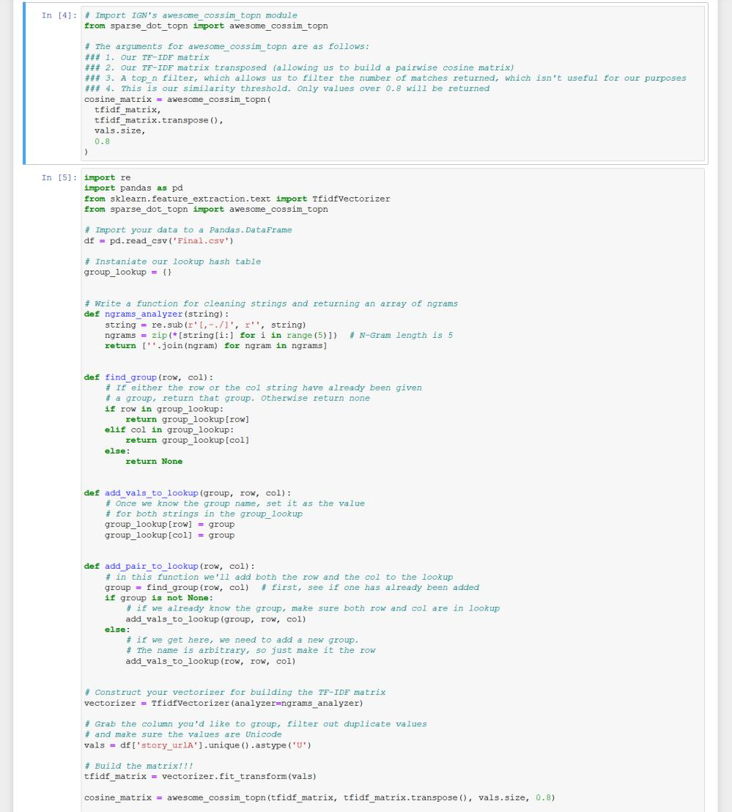
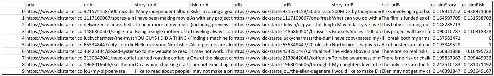

# Kickstarter NLP Similarity Analysis

## Executive Summary

Kickstarter is a funding platform for creative projects. Every project creator sets their project's funding goal and deadline. If people like the project, they can pledge money to make it happen. If the project succeeds in reaching its funding goal, all backers' credit cards are charged when time expires.

For this project, we will be considering two sections from the kickstarter project page. The first one is the "Story" section which in most cases gives a general introduction to the project and the brand, outlining their goals and motivations.



The next section is the "Risks" section which goes over the various challenges the brand faces and how they plan on overcoming those challenges and generally outline their actions towards any common concerns the backers might have.



## Problem Statement

The topic of this research project is to conduct Similarity Analysis on the Story and Risk sections of a number of Kickstarter projects and see if there is any closeness between these sections from the initial campaign start to the end. This will help us understand the level of project consistency and enable us to make informed decisions for backing the project.

## Literature Review

The principal goal of our literature review is to identify which libraries provide the best opportunity for similarity analysis and topic modelling, there are lot of packages that can help with text analytics like Genism, NLTK etc. For the Kickstarter project, we started with an API search to extract textual data and read up on prior work to figure out the best way to extract the text sections from the Kickstarter page where the dataset consisted of around 3800 rows of URL’s. There is not much in terms of prior reseach that was found for this project but based on our earlier research, we devised a process flow on how we would like to go ahead with text preprocessing, feature extraction and modeling.

## Dataset

Dataset was prepared by using Web-Scraping techniques which consisted of the following attributes.

- urla - Url at the beginning of the campaign
- urlb - Url at the end of the campaign
- story from url a - Story text at the beginning of the campaign
- story from url b - Story text at the end of the campaign
- risk from url a - Risk text at the beginning of the campaign
- risk from url b - Story text at the end of the campaign
- similarity score - Dependent variable which is the similarity score

## Data Pre-Processing & Analysis

We start by pre-processing the data using data cleaning techniques like tokenisation, lemmetization, removing stopwords etc. Then we extract the text data for the Story and Risk sections at various points in the campaign.

**Code Snippet for Extracting Text Data**



This script extracts Story and Risk sections from the Kickstarter page for every 200 entries. The code was scheduled on a cluster and the request query was randomized to not overwhelm the server.

**Code Snippet for Conducting the Similarity Analysis**



**Method for Cosine Similarity Analysis**

```
def cos_Sim(X, Y):

    # tokenization
    X_list = word_tokenize(X) 
    Y_list = word_tokenize(Y)

    # sw contains the list of stopwords
    sw = stopwords.words('english') 
    l1 =[];l2 =[]

    # remove stop words from the string
    X_set = {w for w in X_list if not w in sw} 
    Y_set = {w for w in Y_list if not w in sw}

    # form a set containing keywords of both strings 
    rvector = X_set.union(Y_set) 
    for w in rvector:
        if w in X_set: l1.append(1) # create a vector
        else: l1.append(0)
        if w in Y_set: l2.append(1)
        else: l2.append(0)
    c = 0

    # cosine formula 
    for i in range(len(rvector)):
            c+= l1[i]*l2[i]
    
    try:
        cosine = c / float((sum(l1)*sum(l2))**0.5)
    except:
        cosine = 0
    
    return cosine
```

This script extracts the feature set from the data and performs the similarity analysis on the text section
requiring a similarity score between 0-1 (Higher the better).

**Analysis Result**



This output is a .csv file that was generated for both the Story and Risk sections of the data with similarity scores
as two separate columns.

## Conclusion

This project was a very good learning experience. I have learnt a lot about web-scraping and
advanced python. Since Kickstarter is one of the most used sites for funding projects, it’s very interesting to scrape the data from this site and analyse the data to find new insights. I have
also learned how to use some of the advanced libraries in Python for data preprocessing. I learned about Topic
Modelling and specifically about Cosine Similarity and how these techniques are used in predictive text analytics. The next
steps in the project are to apply other similarity techniques and more advanced text preprocessing tools like BOW, TFIDF, etc. and see if we can improve upon our findings and also conduct a Semantic Analysis to further understand how sentiment of the text can be used to influecne better campaign backing.

## References

- https://www.kickstarter.com/
- https://towardsdatascience.com/topic-modeling-and-latent-dirichlet-allocation-in-python-9bf156893c24
